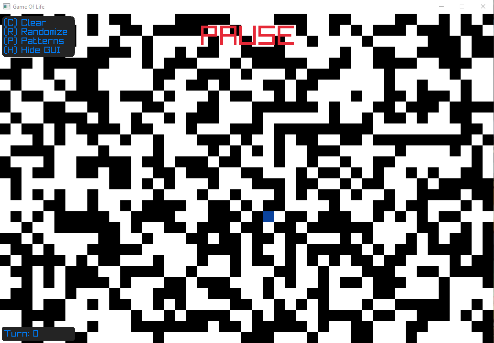
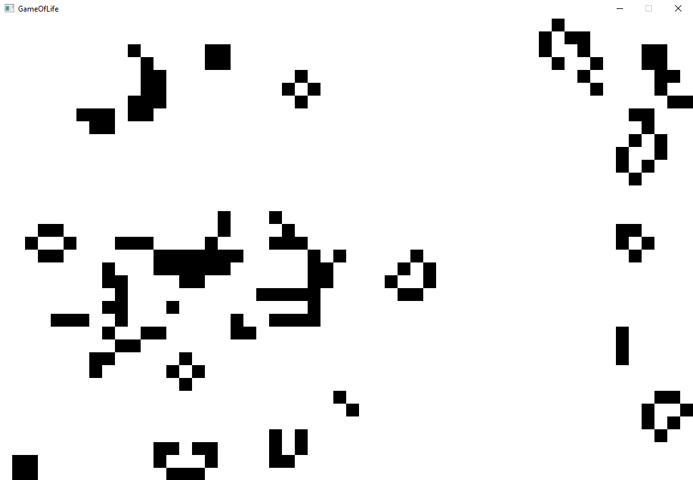

<h3 align="center">Game of Life</h3>

---

⚙️ This is my own implementation of the <a href="https://en.wikipedia.org/wiki/Conway%27s_Game_of_Life">Conway's Game of Life</a> in Go with <a href="https://www.raylib.com/">Raylib</a>.

---
### 🖼️ Screenshots

### ❓ How to use

- C - Clear all cells
- R - Randomize all cells
- P - Open the patterns menu
  - 1 - Create a block
  - 2 - Create a blinker
  - 3 - Create a glider
  - 4 - Create a pentomino

### ❓ How to compile

Download the go compiler [here](https://go.dev/dl/).

Then run this command:
~~~shell
$ go -ldflags -H=windowsgui build .
~~~

Or this one:
~~~shell
$ bash build.sh
~~~
