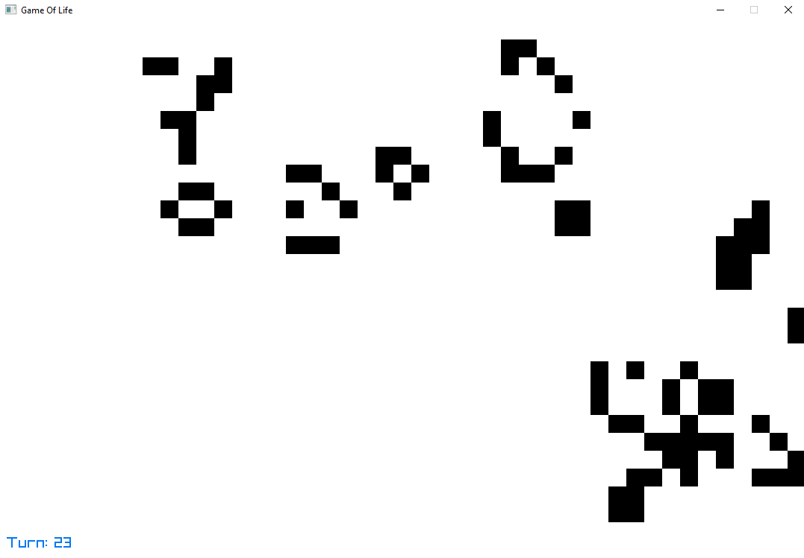

<h3 align="center">
    Game of Life
</h3>

---

<p align="center">
    :gear: This is my own implementation of the <a href="https://en.wikipedia.org/wiki/Conway%27s_Game_of_Life">Conway's Game of Life</a> in C# with <a href="https://www.raylib.com/">Raylib</a>.
</p>

---

### :framed_picture: Screenshots




### :question: How to use
- C - Clear all cells
- R - Randomize all cells
- P - Open the patterns menu
  - 1 - Create a block
  - 2 - Create a blinker
  - 3 - Create a glider
  - 4 - Create a pentomino
- H - Hide the GUI
- ESC - Close windows

### :question: How to build
The simple way to build the project is to use Visual Studio. You just need to open the `.sln` or `.csproj` file and then make a build or run the project.

<details> <summary>Build manualy</summary>
<p>
    If you want to build manualy the project, you will need to install the latest dotnet SDK <a href="https://dotnet.microsoft.com/en-us/download">here</a>.
</p>

<p>
    Then you just need to run the following commands following your OS.
</p>

```console
# windows
dotnet publish -c Release -o ./ -r win-x64 --self-contained true
dotnet publish -c Release -o ./ -r win-x86 --self-contained true

# linux
dotnet publish -c Release -o ./ -r linux-x64 --self-contained true
dotnet publish -c Release -o ./ -r linux-arm --self-contained true

# macos
dotnet publish -c Release -o ./ -r osx-x64 --self-contained true
```
</details>
